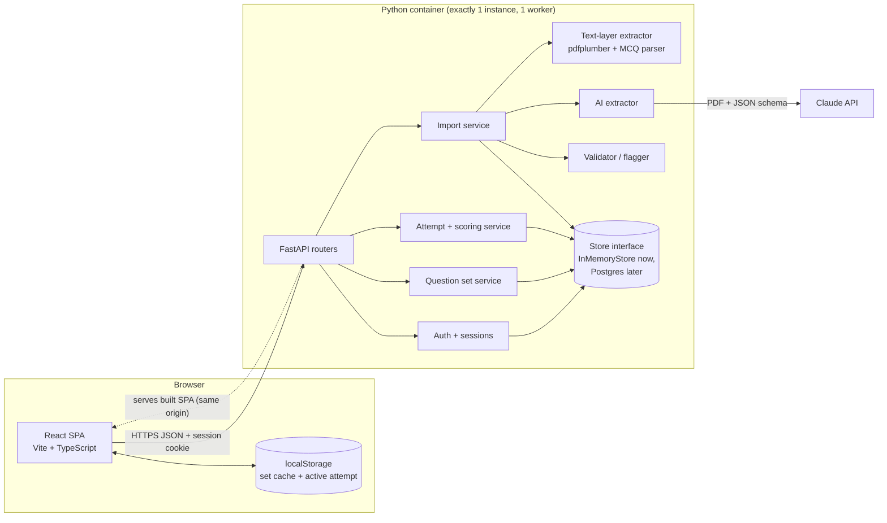

# PrepFlip – Design for the first version

Status: **draft for review**. No code has been written against this design yet.

PrepFlip helps students practise **NEET multiple-choice questions** from their own question papers. A student uploads a PDF or pastes questions, reviews what was extracted, and practises in practice mode or exam mode.

First-version constraints: **React** front end, **Python** backend, basic authentication, **temporary in-memory** backend storage, and a structure that can later be deployed to AWS.

---

## 0. Where the repository stands

The current prototype is plain JavaScript served by a Node server. The target stack is React plus Python, so the UI and server will be rewritten. The logic and lessons carry over.

| Area | Current state (`app.js`, `parser.js`, `server.js`) | Plan |
|---|---|---|
| Text → MCQ parser | **Works.** Handles `1.`/`Q1`, `(A)`/`A)`/`(1)` and options on one line, plus `Answer:`/`Ans:`/`Key:`. Flags empty options, fewer than 2 options, missing answers and unreadable symbols. | Port to Python and reuse its cases as tests |
| AI PDF extraction | **Works.** Sends the PDF to Claude with a JSON schema and flags diagram and uncertain questions. Its prompt stops the model from solving questions. The model ID `claude-opus-5` needs checking. | Port the prompt, schema and error handling to Python |
| Text-only PDF extraction | Works in the browser with pdf.js, but the student must delete non-question text by hand | Move to the backend (pdfplumber) |
| Review screen | **Works.** Edit questions and options, pick the answer, remove questions, preview with KaTeX. The quiz is blocked while anything is flagged. | Rebuild in React with the same behaviour |
| Original/shuffle, practice feedback, question palette | **Works** | Rebuild in React |
| Result | Only shows "X correct of Y attempted" | Counts, +4/−1, question-by-question review |
| Exam mode, mark for review, timer, explanations, retry wrong only | Missing | Build |
| Authentication, saved sets, resume | Missing. Everything is lost when the page is refreshed. | Build |
| Tests, Docker, deployment | Missing. The server listens only on `127.0.0.1`. | Build |

---

## 1. Student journey and smallest useful release

**Journey**

1. Log in.
2. Add a paper: upload a PDF, or paste text with an optional answer key.
3. Review the flagged questions, then fix or remove them.
4. Save the result as a question set.
5. Choose the mode (Practice or Exam) and the order (Original or Shuffle). In exam mode, also choose the timer and marking scheme.
6. Practise, then submit.
7. See the result, review each question, and use "Retry wrong only" if needed.
8. Later: reopen a saved set, or resume an unfinished attempt.

**Release 1: smallest useful release**
- Login.
- Paste text or upload a **text-based** PDF.
- Review and fix the extracted questions.
- Saved question sets.
- **Practice mode** in original or shuffled order.
- A result showing correct, wrong and skipped counts, with question-by-question review.
- Resume an unfinished attempt on the same device.

This is what the prototype does today, plus saving and resuming, and it is already useful for daily practice.

**Release 2**
- Exam mode: mark for review, answer changes, timer and +4/−1 scoring.
- Explanations.
- Retry wrong only.
- AI extraction.
- Fast answer-key paste.

**Later**
- Scanned PDFs through AI.
- Diagrams.
- Long papers.
- Answer keys printed at the end of the PDF.

AI extraction is not in Release 1 because text PDFs plus a pasted answer key cover many papers at no AI cost. AI also needs quotas and cost controls, so it gets its own milestone.

---

## 2. Architecture



### What each component does

- **React SPA**
  - Screens: login, import, review, quiz and results.
  - Saves the active attempt and a copy of each question set in the browser.
  - Runs the timer display.
  - Shows practice-mode feedback immediately.
- **FastAPI routers:** receive requests and validate them with pydantic models. They contain no business logic.
- **Auth:** checks passwords and manages server-side sessions.
- **Import service**
  - Creates an import job.
  - Chooses the text-layer extractor or the AI extractor.
  - Runs the validator.
  - Produces a **draft set**.
- **Validator:** the single place that sets issue codes on questions. Both extractors and every student edit go through it.
- **Attempt service**
  - Creates attempts, including the question order and a copy of the questions.
  - Saves responses.
  - Scores the attempt on submit. The server's score is the official one.
- **Store interface:** `get`/`put`/`list`/`delete` for each entity. It is the only part that changes when a real database is added.

### Key decisions

- **One container serves both the API and the built React app.** Using one origin avoids CORS and makes cookies simpler. Moving the front end to S3 + CloudFront can wait until it is needed.
- **FastAPI** gives typed models, automatic OpenAPI docs and easy `TestClient` tests.
- **Imports run as background jobs** (an asyncio task in the same process). AI extraction can take more than a minute, which is longer than typical proxy timeouts. A queue can come later.
- **In-memory storage means exactly one instance with one worker.** A second worker or instance would have its own separate memory. This rule stays until a database is added.

### Data flow: from PDF upload to result review

1. `POST /api/imports` (multipart). The server checks the file type (`%PDF-`), size and page count, then returns `202 {job_id}`.
2. The job checks whether the PDF has a text layer:
   - If it does, pdfplumber extracts the text and the parser turns it into questions.
   - If it doesn't, or the student chose AI, the AI extractor runs.
   - Both paths produce the same `ExtractedQuestion[]`.
3. The validator adds issue codes and the job stores a **draft set**. The SPA polls `GET /api/imports/{id}` and opens the review screen when the job finishes.
4. The student edits and saves with `PUT /api/sets/{id}`.
   - The validator runs again.
   - The set becomes `ready` once no blocking issues remain.
   - The SPA keeps a copy in localStorage.
5. `POST /api/attempts` creates the question order, a copy of the questions and, in exam mode, a deadline. In exam mode, answers are **not** included in the response.
6. Answers are saved to localStorage immediately and sent to the server about every 2 seconds with `PUT /api/attempts/{id}/responses`.
7. `POST /api/attempts/{id}/submit` scores the attempt. The result comes back with answers and explanations for question-by-question review.
8. "Retry wrong only" calls `POST /api/attempts` with `question_ids` set to the wrongly answered questions.

---

## 3. Data model and API

### Entities

Each entity is a pydantic model, stored as one document in memory.

```
User        id, username, password_hash (argon2), display_name
Session     token_hash, user_id, expires_at
ImportJob   id, owner_id, method: text|ai, status: queued|processing|done|failed,
            progress, error, set_id
QuestionSet id (UUID), owner_id, title, status: draft|ready,
            source {kind: pdf|text, filename, page_count, sha256},
            questions: [Question], created_at, updated_at
Question    id, seq (order in paper), printed_number, page,
            text, options[], answer_index|null,
            answer_source: paper_inline|paper_key|student|null,
            answer_evidence|null, explanation|null,
            issues: [{code, message, blocking}]
Attempt     id (UUID), owner_id, set_id, mode: practice|exam,
            questions: [Question snapshot], order[question_id],
            marking {correct:4, wrong:-1, skipped:0}|null,
            started_at, deadline_at|null, status: in_progress|submitted,
            responses {question_id: {choice|null, marked, visited}},
            result|null, updated_at
Result      correct, wrong, skipped, score|null, max_score|null,
            per_question [{question_id, choice, answer_index, outcome}]
```

- **Attempts keep their own copy of the questions** instead of pointing to the set. Editing a set later can't change old attempts or results, and the extra memory is small.
- **Issues use codes, not free text.** The codes are `MISSING_ANSWER`, `FEW_OPTIONS`, `EMPTY_OPTION`, `UNREADABLE_CHARS`, `NEEDS_FIGURE`, `AI_UNCERTAIN`, `ANSWER_NO_EVIDENCE`, `NUMBERING_GAP` and `DUPLICATE_NUMBER`. The UI and the tests rely on codes, not on the wording.

### API endpoints

All endpoints are under `/api`. Everything except login and health requires a session.

| Method and path | Purpose |
|---|---|
| `POST /auth/login`, `POST /auth/logout`, `GET /auth/me` | Session cookie |
| `GET /health`, `GET /config` | Health check. Config returns flags: AI on/off, limits, the user's remaining quota. |
| `POST /imports` (multipart PDF, `method`) → 202 | Start PDF extraction |
| `GET /imports/{id}` | Job status, plus `set_id` when done |
| `POST /imports/text` `{text, answer_key?}` → 201 set | Fast, synchronous text parsing |
| `GET /sets` | The user's sets (summary only) |
| `GET /sets/{id}`, `PUT /sets/{id}`, `DELETE /sets/{id}` | `PUT` creates or updates using a UUID chosen by the browser. It is also how sets are restored after a server restart. |
| `POST /sets/{id}/answer-key` `{text}` | Apply a pasted answer key such as `1-3, 2-1…`, matched by printed question number |
| `POST /attempts` `{set_id, mode, order, timer_minutes?, marking?, question_ids?}` | Create an attempt |
| `GET /attempts?status=in_progress`, `GET /attempts/{id}` | Exam attempts leave out answers until submitted |
| `PUT /attempts/{id}` | Create or update; used to restore from the browser after a restart |
| `PUT /attempts/{id}/responses` | Save the whole set of responses (safe to repeat) |
| `POST /attempts/{id}/submit` | Score the attempt and return the result |

Requesting another user's resource returns **404, not 403**, so its existence isn't revealed.

---

## 4. PDF processing

```
upload → checks (PDF header, ≤20 MB, ≤60 pages in v1) → sha256
      → has text layer? ── yes → pdfplumber (per page, column-aware) → MCQ parser
                        └─ no / student chose AI → Claude (existing prompt + schema)
      → normalise to ExtractedQuestion[] → validator → draft set
```

### Keeping question order

- **Every question keeps `seq`, its position in the paper**, as given by the extractor. The AI schema gains `printed_number` and `page` fields, and the prompt asks for questions "in the order they appear".
- **Questions are never re-sorted by printed number.** NEET numbering can restart or have gaps between subjects and sections, so re-sorting would scramble papers.
- **Printed numbers are checked against the order of appearance.** The validator flags `NUMBERING_GAP` (for example, "Q57 missing between 56 and 58") and `DUPLICATE_NUMBER`. A dropped question is flagged instead of vanishing silently.
- **Two-column papers are the main risk for text extraction.**
  - The extractor detects columns from word x-positions and reads the left column before the right one.
  - If it isn't confident about the columns, it flags the page and suggests AI extraction.

### Flagging uncertain extraction

- **Blocking issues** must be fixed, or the question removed, before the quiz can start:
  - missing answer
  - fewer than 2 options
  - an empty option
  - unreadable characters
- **Advisory issues** need one "I've checked it" click:
  - `AI_UNCERTAIN`
  - `NEEDS_FIGURE`
  - `NUMBERING_GAP`
- **The review screen gets two shortcuts:** a "Show only flagged" filter and a bulk "Remove all flagged" action. Without them, reviewing a 180-question paper is painful.

### Never inventing correct answers

- **Answers come only from the paper.**
  - An answer is set only when it appears in the paper itself.
  - `answer_source` records where it came from: an inline answer, the paper's answer key, or the student.
- **AI answers must come with evidence.**
  - The AI must return `answer_evidence`, a short quote such as `"Answer key p.24: 57 (3)"`.
  - An AI answer without evidence is reset to `null` and flagged `ANSWER_NO_EVIDENCE`.
  - The server can't prove the model didn't solve a question, but the evidence requirement makes guessing visible and testable.
- **The prompt keeps its existing rule** never to solve questions.
- **Papers without answers get a fast answer-key paste.**
  - Students paste a key such as `1-3 2-1 3-4…` or `1.(3) 2.(1)`, matched by printed number.
  - This is much faster than clicking 180 radio buttons.
  - The same code will later read **answer keys at the end of a PDF**.

### Planned improvements, already allowed for

- **Scanned PDFs:** already handled by the AI path. The UI will send PDFs without a text layer there automatically.
- **Diagrams:** each question has a `page` field, so review and the quiz can show a thumbnail of the source page for `NEEDS_FIGURE` questions. Cropping to the figure comes later.
- **Long papers:**
  - Split the PDF into page ranges with one page of overlap and extract them in parallel.
  - Remove duplicates in the overlap by printed number and text similarity.
  - `ImportJob.progress` already exists for showing progress.

---

## 5. Authentication, in-memory data and browser-saved progress

### Authentication

- **"Basic authentication" means a username and password login form**, not HTTP Basic auth. HTTP Basic can't log out cleanly and shows the browser's own password pop-up.
- **Passwords** are hashed with argon2.
- **Sessions** use a random token in a cookie marked `HttpOnly; SameSite=Lax`, plus `Secure` in production.
- **Login attempts** are rate-limited.
- **CSRF** is covered at this stage because the API accepts only JSON and file uploads, and everything is served from one origin.
- **Accounts come from a config file** in v1: `users.json` with password hashes, plus a small `hash-password` script. There is no sign-up. Sign-ups kept in memory would disappear on every restart, which would confuse users. Sign-up arrives with the database.

### Where data lives

- **Server memory** is the main copy while the server is running. It holds sets, attempts, results, sessions and jobs.
- **Browser storage** (localStorage, keyed by user ID, with every access wrapped in try/catch) holds:
  - a copy of each question set
  - the full state of any in-progress attempt, including an absolute `deadline_at`, not "minutes left"
  - the last ~20 results
- **Timers on resume:** the time left is recalculated from the deadline. If the deadline has passed, the attempt is submitted automatically.
- **Restoring after a server restart:** when the SPA starts, it compares its local copy with the server. Anything missing from the server is sent back with the create-or-update `PUT` calls. This is why IDs are UUIDs chosen by the browser and why those calls are safe to repeat.

### What is lost, and when

| Event | Lost | Survives |
|---|---|---|
| **Server restart or redeploy** | Every login session (everyone must log in again), running import jobs, and sets and attempts from devices that never reconnect | Accounts (from the config file). After logging in, each device restores its cached sets, any in-progress attempt and recent results. |
| **Browser data cleared** | Local copies, and answers not yet sent to the server (at most ~2 seconds' worth). Same-device resume also fails if the server has restarted too. | Everything on the server, if it hasn't restarted. Resuming still works from the server copy. |
| **Both** | Everything for that user | Only the account |
| **Private window or another device** | No local copy | Server data while the server keeps running. This is a bonus, not a promise. |

The UI should say this plainly: *"Saved on this device. Server storage is temporary during the pilot."*

---

## 6. AWS deployment

### Pilot, matching in-memory storage

- **One multi-stage Dockerfile.** Node builds the React app. The Python image runs `uvicorn --workers 1`.
- **One ECS Fargate task behind an Application Load Balancer**, with an ACM certificate for HTTPS, in **ap-south-1 (Mumbai)** to be close to Indian students.
  - Minimum and maximum task count are both 1.
  - The health check calls `/api/health`.
  - Logs go to CloudWatch.
  - Estimated cost is about $30–40 per month for Fargate plus the load balancer, before AI usage.
- **Cheaper alternative:** Lightsail Containers, with HTTPS included, at roughly $10 per month. The same image runs on either.
- **Secrets:** the Anthropic key and the session secret live in Secrets Manager or SSM Parameter Store and reach the app as environment variables. They are never built into the image or sent to the browser.

### Changes needed before public use

1. **Persistence**
   - Add Postgres (RDS) behind the existing Store interface, with questions stored as JSONB.
   - Move import jobs into the database, and background work to SQS plus a worker, so the app can run more than one instance.
   - Either don't keep uploaded PDFs, or keep them in S3 with a short expiry rule (for example, 7 days).
   - Trade-off: DynamoDB costs less when idle, but Postgres makes history and "weak topics" queries much easier.
2. **HTTPS and security**
   - HSTS, and secure cookies only.
   - Optionally move the front end to S3 + CloudFront, with `/api/*` routed to the load balancer.
   - Web application firewall (WAF) rate limits on login and imports.
   - Real sign-up and password reset, with email sent through SES.
3. **Secrets:** rotate them regularly, give the task only the IAM permissions it needs, and keep none in the repository (`.env` is already git-ignored).
4. **AI usage costs**
   - A daily page limit per user, shown in the UI, and a page limit per upload.
   - **Cache extraction results by the PDF's sha256 hash.** Many students upload the same paper, so this avoids paying for it twice.
   - Log token usage for each request.
   - Protect the total spend with a global kill switch (an environment variable), a spending limit in the Anthropic console and a CloudWatch alarm.
   - Before choosing a model, test a cheaper one against a small set of real papers.
5. **Legal**
   - Many NEET students are under 18. India's DPDP Act has rules for children's data, including parental consent, which need a proper check.
   - Publish a privacy policy.
   - Keep question sets **private to each user**, because sharing uploaded papers raises copyright questions.

---

## 7. Implementation plan

Each milestone is a small PR with tests:
- **Backend:** pytest with FastAPI `TestClient`.
- **Front end:** Vitest with React Testing Library.
- **Key end-to-end flows:** Playwright.

| # | Milestone | Acceptance criteria | Meaningful tests |
|---|---|---|---|
| M0 | Repo skeleton: `frontend/`, `backend/` (`api/`, `services/`, `store/`, `models.py`) and a Dockerfile. The prototype moves to `legacy/`. | `docker run` serves the React page and `/api/health` | Health check. Store tests that any future storage backend must also pass. |
| M1 | Authentication | Login and logout work. Protected pages redirect to login. | Wrong password → 401. Cookie flags are set. No session → 401. The rate limit triggers. User A gets 404 for user B's set. |
| M2 | Text import, Python parser and React review screen, with saved sets | Paste the sample, fix the flags, save, reload: the set is still there | Run the existing JS parser to produce expected outputs, and require the Python version to match them. One test per issue code. Answer-key paste is matched by printed number. |
| M3 | Practice mode and basic results (**Release 1 candidate**) | Original or shuffled order, instant feedback, counts, question-by-question review | Shuffle produces a genuine reordering (seeded). Table tests for scoring. An answer can't be changed in practice mode. |
| M4 | Browser saving, resume and restore | Reloading mid-attempt resumes it. After a backend restart, sets and the attempt are restored. | Playwright: answer 3 questions, reload, attempt resumes. Clear the server store, reload, data restored. Clear localStorage, attempt resumes from the server. |
| M5 | Text-based PDF import as a background job (**Release 1**) | Uploading a text NEET PDF gives a draft set in paper order | Small generated PDF samples, including **two-column** layouts. Order preserved. Gap and duplicate flags raised. Non-PDFs, oversized files and too many pages are rejected. Job status changes are correct. |
| M6 | Exam mode | Answers hidden and changeable. Mark for review. Four palette states. Timer with automatic submit. +4/−1 scoring. | The API response for an exam attempt contains no `answer_index`. All 180 correct scores 720. A mixed case with negative marks. Deadline tested with fake timers. A submit after the deadline uses the last saved responses. |
| M7 | Explanations and "Retry wrong only" | Explanations appear after answering and in results. The retry contains exactly the wrong questions. | Retry questions equal the wrong set. Order and mode are respected. |
| M8 | AI extraction with quotas and a hash cache | Scanned PDFs work. Answers without evidence are flagged. | Mocked Claude client: mapping into the schema, the evidence rule, refusal and max_tokens errors, quota exceeded → 429, same hash → no second AI call. **Manual check on 3–5 real papers:** record question count, order and answer accuracy. |
| M9 | AWS pilot | Log in over HTTPS from a phone. Secrets come from SSM. | A smoke-test script run against the deployed URL. |

---

## Assumptions that need confirmation

1. **"Basic authentication"** means a login form with accounts created ahead of time, and no sign-up while storage is in memory.
2. **Pilot size** is about 10–50 students, so one instance is enough.
3. **AI extraction** comes in Release 2. Release 1 covers text PDFs plus answer-key paste.
4. **"Retry wrong only"** leaves out skipped questions, with a checkbox to include them.
5. **The default timer** is 1 minute per question, matching NEET's 180 questions in 180 minutes, and can be changed.
6. **The Node prototype** moves to `legacy/` and is deleted once the new app does everything it did.
7. **The AWS region** is Mumbai (ap-south-1).
